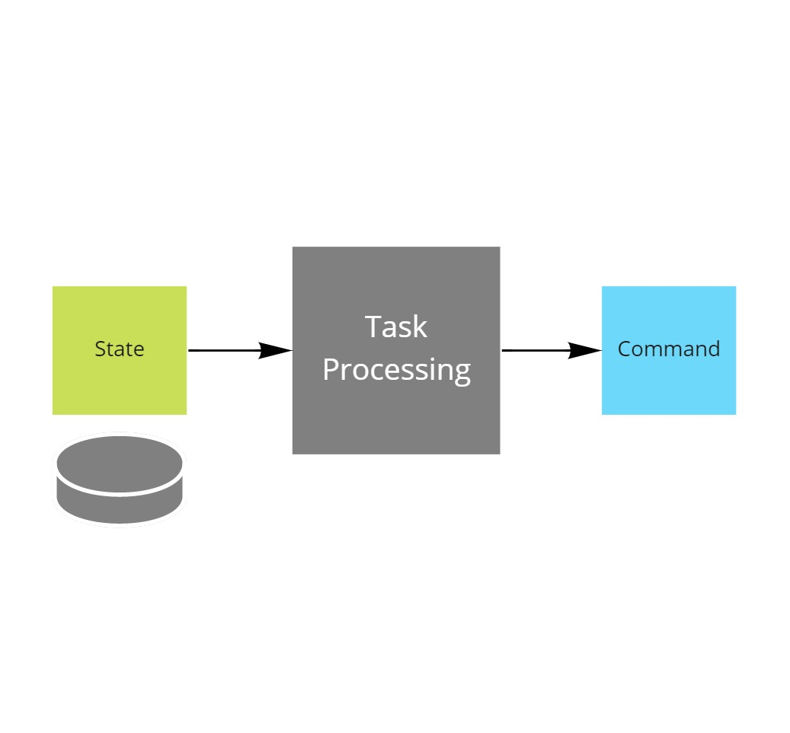

# Implementing Task Processing

This project is part of the [MessageHandler processing patterns](https://www.messagehandler.net/patterns/) library.

MessageHandler is distributed under a commercial license, for more information on the terms and conditions refer to [our license page](https://www.messagehandler.net/license/).

## What is Task Processing

Task processing is the simple act of looking at a set of data and then deciding what needs to be done with it by invoking a command.



## When to use it

Use this pattern every time a task needs to be invoked after a certain condition has become true.

Some people also call this the todo-list pattern, where the state represents what should be done somewhere in the future, while the processor instructs the system to perform the action, item by item.

Task processing is very often done by humans, but it can also be automated when the conditions for invoking the command are well known.

## What you need to get started

- The [.NET 6 SDK](https://dotnet.microsoft.com/en-us/download) should be installed
- The sample was created using [Visual Studio 2022 community edition](https://visualstudio.microsoft.com/vs/)
- To dispatch the command an [azure service bus namespace](https://docs.microsoft.com/en-us/azure/service-bus-messaging/service-bus-create-namespace-portal) is used.
- The **MessageHandler.Runtime.AtomicProcessing** package is available from [nuget.org](https://www.nuget.org/packages/MessageHandler.Runtime.AtomicProcessing/)

## Running the sample

Prior to being able to run the sample, you need to [configure the user secrets file](https://docs.microsoft.com/en-us/aspnet/core/security/app-secrets?view=aspnetcore-6.0&tabs=windows#manage-user-secrets-with-visual-studio).

In the secrets file you must specify the following configuration values.

```JSON
{
  "servicebusnamespace": "your azure service bus connection string goes here"
}
```

Also ensure a queue named `emails` is created up front in the service bus namespace.

Once configured you can start the worker or run the unittests.

<!-- ## Designed with testing in mind

MessageHandler is intented to be test friendly.

This sample contains plenty of ideas on how to test a task processing without requiring a dependency on an actual servicebus namespace, and thus keep the tests fast.

- [Unit tests](/src/Tests/UnitTests): To test the actual logic in the task processing. Unit tests should make up the bulk of all tests in the system.
- [Component tests](/src/Tests/ComponentTests): To test the api used to expose the task processing.
- [Contract tests](/src/Tests/ContractTests): To verify that the test doubles used in the unit and component tests are behaving the same as an actual dependency would. Note: contract verification files are often shared between producers and consumers of the contract.

## How to implement it yourself

Check out [this how to guide](https://www.messagehandler.net/docs/guides/event-sourcing/task-processing/) to learn how to implement this pattern. -->